# StackGAN-revision and demos

This is StackGAN revised version for Google Colab.

Refer to [https://github.com/hanzhanggit/StackGAN](https://github.com/hanzhanggit/StackGAN) for original source version, 
it is implementation for the paper [StackGAN: Text to Photo-realistic Image Synthesis with Stacked Generative Adversarial Networks](https://arxiv.org/pdf/1612.03242v1.pdf).

Refer to troubleshooting [issues](https://github.com/rightlit/StackGAN-rev/issues) while running with original source 

### Dependencies
python == 3.6

TensorFlow == 1.7 (prettytensor supported)

pytorch == 1.2

Torch7 (http://torch.ch/docs/getting-started.html#_)

In addition, please add the project folder to PYTHONPATH and `pip install` the following packages:
- `prettytensor==0.7.4`
- `torchfile`
- `lupa`
- `scipy==1.1.0`
- `torchvision==0.4.0`

**Data**

1. Download preprocessed char-CNN-RNN text embeddings for [birds](https://drive.google.com/open?id=0B3y_msrWZaXLT1BZdVdycDY5TEE) and [flowers](https://drive.google.com/open?id=0B3y_msrWZaXLaUc0UXpmcnhaVmM) and save them to `Data/`.
  - [Optional] Follow the instructions [reedscot/icml2016](https://github.com/reedscot/icml2016) to download the pretrained char-CNN-RNN text encoders and extract text embeddings.
2. Download the [birds](http://www.vision.caltech.edu/visipedia/CUB-200-2011.html) and [flowers](http://www.robots.ox.ac.uk/~vgg/data/flowers/102/) image data. Extract them to `Data/birds/` and `Data/flowers/`, respectively.

**Run Demos**
- Run `sh demo/flowers_demo.sh` to generate flower samples from sentences. The results will be saved to `Data/flowers/example_captions/`. 
- Run `sh demo/birds_demo.sh` to generate bird samples from sentences. The results will be saved to `Data/birds/example_captions/`.

**Examples for birds (char-CNN-RNN embeddings):**

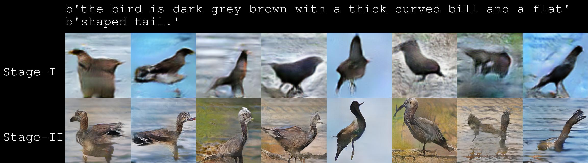
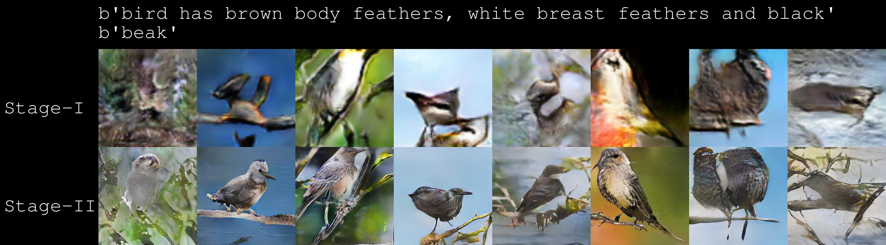
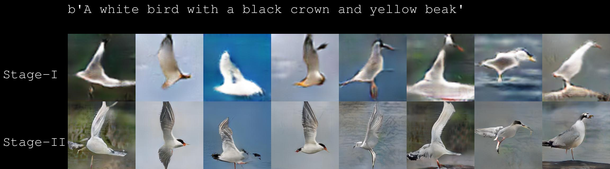
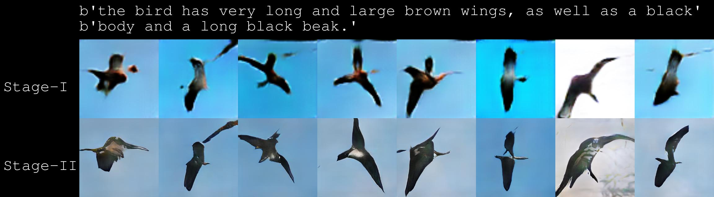
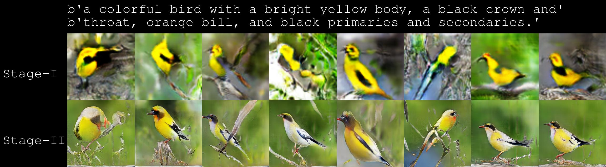
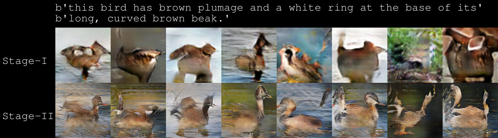
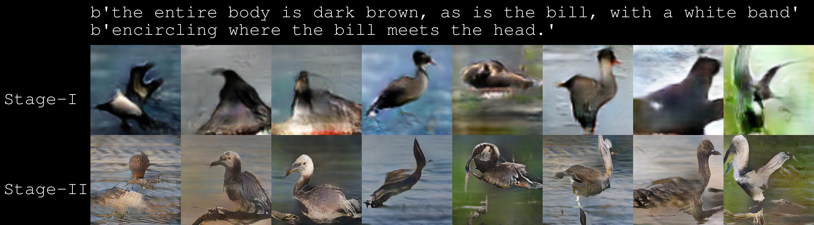
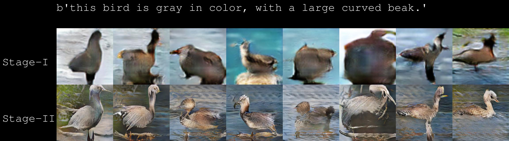

**Examples for flowers (char-CNN-RNN embeddings):**
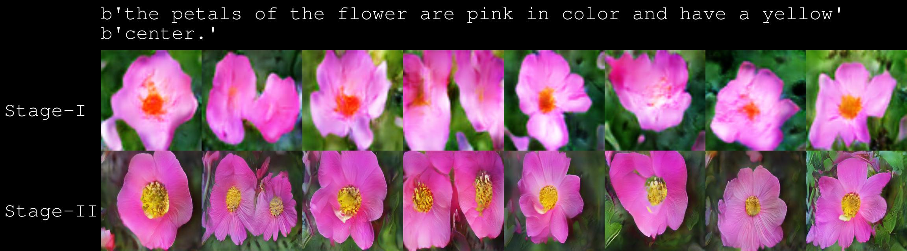
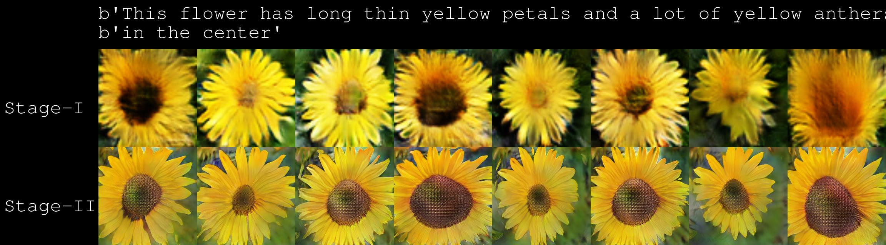
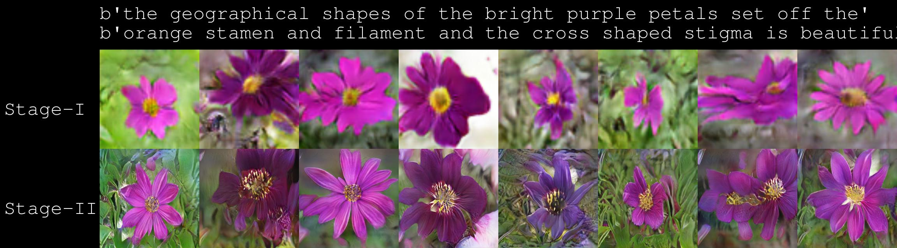
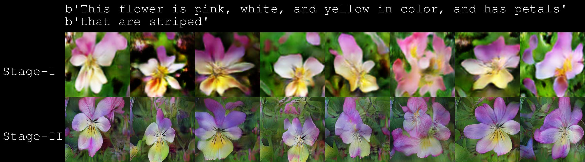
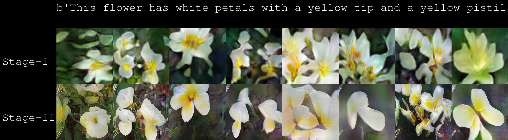
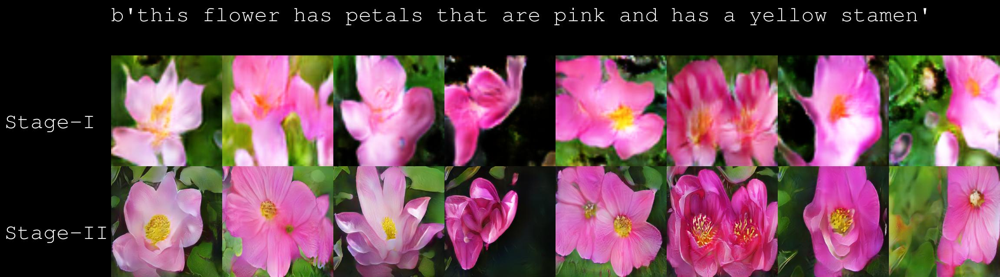
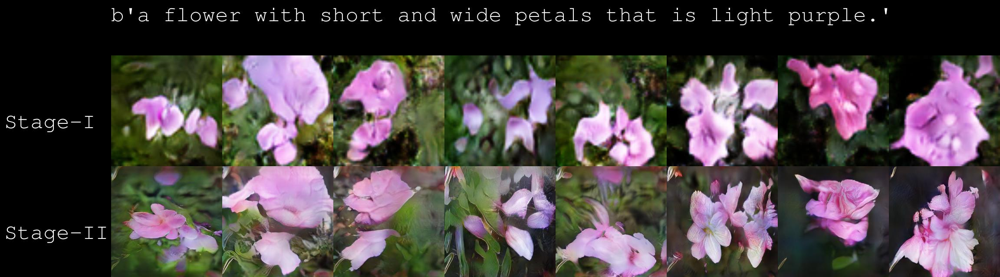
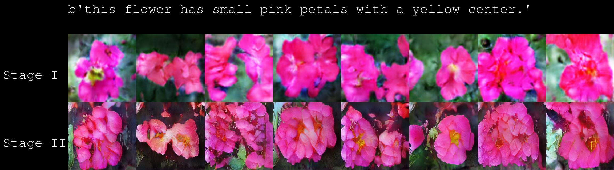
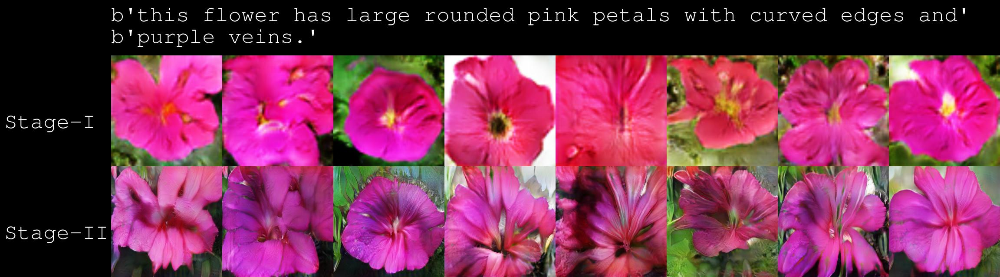

**References**

- Generative Adversarial Text-to-Image Synthesis [Paper](https://arxiv.org/abs/1605.05396) [Code](https://github.com/reedscot/icml2016)
- Learning Deep Representations of Fine-grained Visual Descriptions [Paper](https://arxiv.org/abs/1605.05395) [Code](https://github.com/reedscot/cvpr2016)
