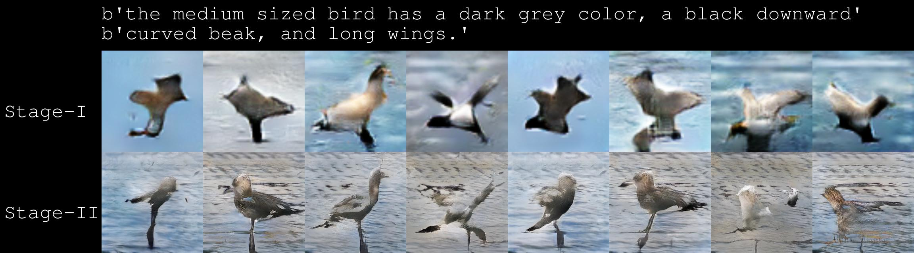
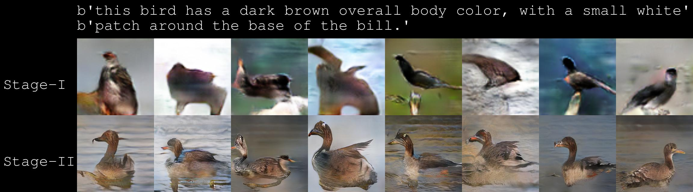
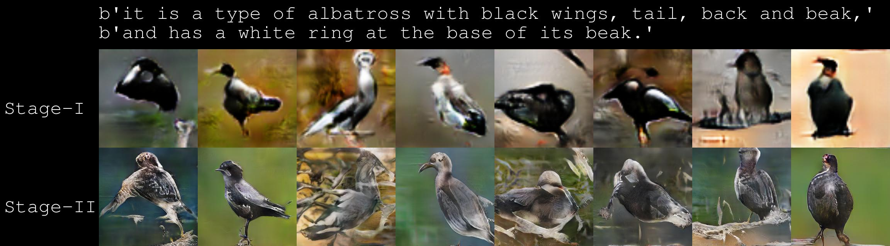
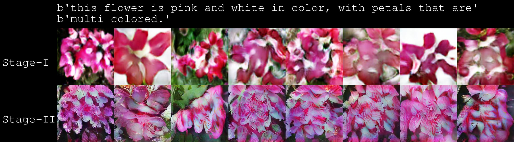
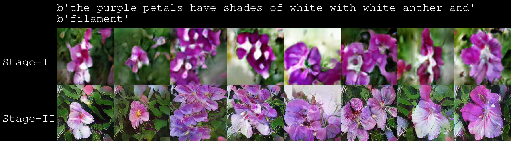
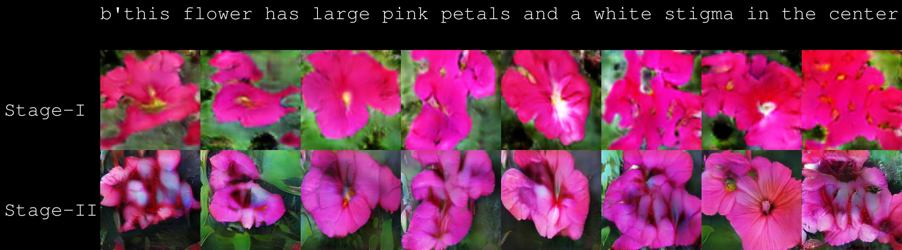

# StackGAN-revision for Colab

This is StackGAN revised version for Google Colab.

Refer to [https://github.com/hanzhanggit/StackGAN](https://github.com/hanzhanggit/StackGAN) for original source version, 
it is implementation for the paper [StackGAN: Text to Photo-realistic Image Synthesis with Stacked Generative Adversarial Networks](https://arxiv.org/pdf/1612.03242v1.pdf).

Refer to troubleshooting [issues](https://github.com/rightlit/StackGAN-rev/issues) while running with original source 

### Dependencies
python == 3.6

TensorFlow == 1.7 (prettytensor supported)

pytorch == 1.2

Torch7 (http://torch.ch/docs/getting-started.html#_)

In addition, please add the project folder to PYTHONPATH and `pip install` the following packages:
- `prettytensor==0.7.4`
- `torchfile`
- `lupa`
- `scipy==1.1.0`
- `torchvision==0.4.0`

**Run Demos**
- Run `sh demo/flowers_demo.sh` to generate flower samples from sentences. The results will be saved to `Data/flowers/example_captions/`. (Need to [download](https://drive.google.com/file/d/0B0ywwgffWnLLZUt0UmQ1LU1oWlU/view) the char-CNN-RNN text encoder for flowers to `models/text_encoder/`. Note: this text encoder is provided by [reedscot/icml2016](https://github.com/reedscot/icml2016)).
- Run `sh demo/birds_demo.sh` to generate bird samples from sentences. The results will be saved to `Data/birds/example_captions/`.(Need to [download](https://drive.google.com/file/d/0B0ywwgffWnLLU0F3UHA3NzFTNEE/view) the char-CNN-RNN text encoder for birds to `models/text_encoder/`. Note: this text encoder is provided by [reedscot/icml2016](https://github.com/reedscot/icml2016)).
- Run `python demo/birds_skip_thought_demo.py --cfg demo/cfg/birds-skip-thought-demo.yml --gpu 2` to generate bird samples from sentences. The results will be saved to `Data/birds/example_captions-skip-thought/`. (Need to [download](https://github.com/ryankiros/skip-thoughts) vocabulary for skip-thought vectors to `Data/skipthoughts/`).

Examples for birds (char-CNN-RNN embeddings), more on [youtube](https://youtu.be/93yaf_kE0Fg):

Examples for flowers (char-CNN-RNN embeddings), more on [youtube](https://youtu.be/SuRyL5vhCIM):

**References**

- Generative Adversarial Text-to-Image Synthesis [Paper](https://arxiv.org/abs/1605.05396) [Code](https://github.com/reedscot/icml2016)
- Learning Deep Representations of Fine-grained Visual Descriptions [Paper](https://arxiv.org/abs/1605.05395) [Code](https://github.com/reedscot/cvpr2016)
